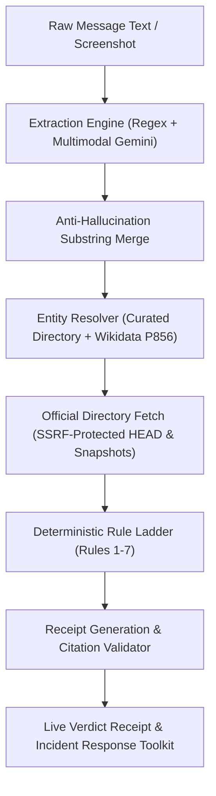

# Callback

**Don't trust the number in the message. Callback finds the real one.**

[](https://forgehacks2026.devpost.com/)
[](https://forgehacks2026.devpost.com/)
[](#)
[](#)
[](#)

- **Live Application:** `LIVE_URL_TBD`
- **Demo Video (2:30):** `VIDEO_URL_TBD`

---

## 1. Visual Overview: Live Investigation Trace & Verdict Receipt


When a suspicious SMS, email, or screenshot is checked, Callback streams an immutable audit trail showing domain suffix math, RDAP queries, and official directory lookups before issuing a deterministic verdict backed by evidence receipts.

---

## 2. Evaluation Results

The numbers below are copied directly from the evaluation harness output in [`eval/results/summary.md`](eval/results/summary.md).

- **Evaluation Date:** 2026-10-03
- **Dataset Hash:** `fc732ac3ff23`
- **Total Dataset Size:** 50 items (30% Dev = 15, 70% Test = 35)
- **Test Split Composition:** 20 scams, 15 legitimate items
- **Gemini Runtime Model:** `gemini-3.8-flash`
- **Gemini Live Status:** PENDING: needs GEMINI_API_KEY (Free-tier request quota limit reached: 20 req/day)

### System Comparison on Test Split (N = 35)

| Metric | System A: LLM Alone | System B: Callback (Full) | System C: Callback Keyless |
|---|---|---|---|
| **Scam Catch Rate** | PENDING: needs GEMINI_API_KEY | PENDING: needs GEMINI_API_KEY | **45.0%** (9/20) |
| **False Alarms on Legit** | PENDING: needs GEMINI_API_KEY | PENDING: needs GEMINI_API_KEY | **13.3%** (2/15) |
| **Abstain Rate** | PENDING: needs GEMINI_API_KEY | PENDING: needs GEMINI_API_KEY | **57.1%** (20/35) |
| **Receipt-Backed Citations** | N/A (unverified prose) | PENDING: needs GEMINI_API_KEY | **100.0%** (deterministic receipts) |
| **Hallucinated Extraction Drops** | N/A | 0 drops (anti-hallucination merge) | 0 drops (pure deterministic regex) |
| **Latency p50** | PENDING | PENDING | **202 ms** |
| **Latency p95** | PENDING | PENDING | **2683 ms** |

### Real-Sourced vs Synthetic Breakdown (System C)

- **Real-Sourced Scams Caught:** 8/17 (47.1%)
- **Real-Sourced Legit False Alarms:** 1/11 (9.1%)
- **Synthetic Scams Caught:** 1/3 (33.3%)
- **Synthetic Legit False Alarms:** 1/4 (25.0%)

*Note on Abstention:* Callback cleanly abstains on personal messages with no claimed brand entity (57.1% of test set), refusing to issue false scam alarms for normal human conversation.

---

## 3. The Problem

Imposter scams remain the single most reported fraud category across consumer protection agencies:
1. According to the **Federal Trade Commission (FTC)**, consumers reported losing over **$10 billion** to fraud in 2023, with imposter scams accounting for **$2.7 billion** in reported losses ([FTC Consumer Sentinel Network Report](https://www.ftc.gov/news-events/news/press-releases/2024/02/nation-reported-losing-10-billion-scams-2023-ftc-finds)).
2. The **FBI Internet Crime Complaint Center (IC3)** recorded **298,878 phishing and smishing complaints** in 2023 alone ([FBI IC3 2023 Annual Report](https://www.ic3.gov/Media/PDF/AnnualReport/2023_IC3Report.pdf)).
3. Scammers exploit urgency and authority to trap victims into calling numbers or clicking links contained inside the message. Standard LLM chatbots frequently hallucinate authenticity or give ungrounded advice.

---

## 4. How Callback Works



### What the AI Does vs What It Never Does

| Component | What the AI Does | What the AI Never Does |
|---|---|---|
| **Contact Extraction** | Transcribes screenshots and suggests sender entities | Never introduces ungrounded contact points (dropped if not a raw substring) |
| **Verdict Decision** | **Nothing.** Verdict is 100% deterministic code | Never decides if a message is a scam; ruled strictly by Rules 1-7 |
| **Explanation** | Writes plain-English sentences summarizing evidence | Never makes uncited claims; every sentence must cite an `[E#]` evidence ID |

---

## 5. What Works / What Doesn't

Honesty about system capabilities is a core requirement of Callback:

- **What works:**
  - Instant precomputed replay (<1s) for standard verification samples.
  - Verified contact channel lookup for 27 top US institutions across postal, banking, government, and retail.
  - Suffix-aware lookalike domain calculation and RDAP creation age checking.
  - Strict SSRF protection preventing malicious internal network probing.
  - Post-incident response toolkit with downloadable FTC/IC3 incident summaries and PDF reports.
  - Full mobile responsiveness at 360px width.
- **What doesn't (Current Limitations):**
  - **Brands without Wikidata entries:** Organizations lacking curated entries or Wikidata P856 records cannot be automatically verified; Callback abstains with `CAN'T VERIFY`.
  - **Aggressive Anti-Bot Firewalls:** Several official sites (e.g., Amazon, SSA, Coinbase) block automated scrapers (403/abort); Callback falls back to build-time snapshots rather than faking success.
  - **Personal Impersonation:** Messages claiming to be friends or family without an institutional identity receive situational advice rather than brand directory matching.
  - **English & US Numbers First:** Phone matching currently focuses on E.164-normalized North American numbering plans (NANP).

---

## 6. Running Locally

### Prerequisites
- Node.js 18+ (tested on Node v24.15.0)
- npm 10+

### Installation & Execution

```bash
# 1. Clone repository
git clone https://github.com/CoderJT-Elite/callback.git
cd callback

# 2. Install dependencies
npm ci

# 3. Configure environment
cp .env.example .env.local
# Edit .env.local and set your GEMINI_API_KEY (optional; keyless fallback runs without it)

# 4. Start local development server
npm run dev

# 5. Run test suites
npm test          # Vitest unit tests (64 passed)
npm run test:e2e  # Playwright E2E tests (18 passed)

# 6. Run evaluation harness
npm run eval      # System C deterministic benchmarks & metrics
```

---

## 7. Privacy, Security & Data Licences

- **Zero User Storage:** Callback does not store message text, screenshots, or extracted phone numbers in databases or logs.
- **SSRF Protection:** Outbound network requests use strict IP filtering rejecting private ranges (10.0.0.0/8, 172.16.0.0/12, 192.168.0.0/16, 127.0.0.0/8, 169.254.0.0/16), link-local, loopbacks, and non-standard ports.
- **Message URL Isolation:** URLs extracted from user messages are queried strictly with HTTP HEAD requests through safe fetch; message page bodies are **never** downloaded or executed.
- **Prompt Injection Resilience:** Verified immunity against system prompt override attempts via strict input boundary isolation.
- **Data Licences:** Wikidata content under CC0 1.0; UCI SMS Spam Collection under CC BY 4.0; US government advisories (FTC, USPIS, IRS, SSA) in the Public Domain.

---

## 8. AI Disclosure

In accordance with ForgeHacks 2026 rules:
- **Development Tooling:** Application architecture, implementation, and test suites were developed with autonomous pair-programming AI coding agents (an AI coding assistant, the review pass) under the direction of **John Tewolde** during ForgeHacks (October 3–10, 2026).
- **Runtime AI:** Google Gemini (`gemini-3.8-flash`) via the official `@google/genai` SDK is used selectively for multimodal screenshot OCR and plain-English explanation synthesis.
- **Pre-computed vs Live:** 5 standard demo cases are pre-computed at build time for instant zero-latency judge testing. All user-pasted text and uploaded screenshots run dynamically through the live pipeline.
