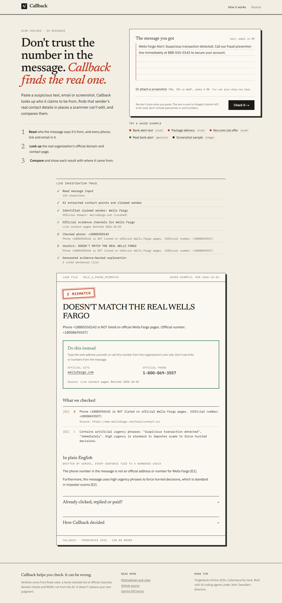
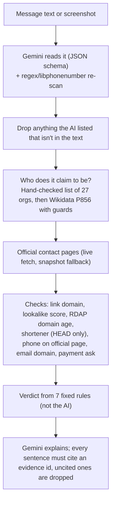

# Callback

**Don't trust the number in the message. Callback finds the real one.**

Paste a suspicious text or email, or drop a screenshot. Callback works out who the message claims to
be from, looks up that organization's official channels from sources the scammer doesn't control,
and shows, with receipts, whether the phone number, link and email in the message really belong to
them.

- **Live app:** https://callback-lac.vercel.app
- **Demo video:** `VIDEO_URL_TBD`
- **Track:** AI + Cybersecurity, ForgeHacks Online 2026



## Why

Imposter scams were the most reported fraud category in 2025: nearly one in three fraud reports to
the FTC, with $3.5 billion in reported losses. The FTC says some of the costliest start with a fake
security alert, often from a bank
([FTC, June 2026](https://www.ftc.gov/news-events/news/press-releases/2026/06/ftc-data-show-people-reported-losing-3-point-5-billion-imposter-scams-2025)).
The FBI's IC3 logged 298,878 phishing/spoofing complaints in 2023, more than any other crime type
([IC3 2023 report](https://www.ic3.gov/Media/PDF/AnnualReport/2023_IC3Report.pdf), p. 20).

Each of these scams needs you to use the scammer's channel instead of the real one. The standard
advice is "contact the company through a number you find yourself." Callback does that lookup for
you, and it doesn't care how well the message is written, so AI-polished scams don't get a pass.

## How it works



| Part | What the AI does | What it never does |
|---|---|---|
| Reading | Reads the message or screenshot and lists the claimed sender, contact points and asks | Add contact points: anything not found in the original text is dropped |
| Verdict | Nothing | Decide the verdict. Seven ordered rules do that (shown on `/how-it-works`) |
| Explanation | Writes 2-5 plain sentences from the evidence list (it never sees the raw message) | Make an uncited claim: sentences without a valid `[E#]` are dropped |

Verdicts: **DOESN'T MATCH** (with the real channel to use instead), **MATCHES**, **CAN'T VERIFY**
(with what was and wasn't checked), or **NO ORGANIZATION CLAIMED** (family/new-number messages get
"call them on the number you already have"). If you already clicked or paid, the respond panel lists
next steps and builds an incident summary (`.txt` download or print-to-PDF) to paste into
ReportFraud.ftc.gov or ic3.gov.

## Evaluation

From [`eval/results/summary.md`](eval/results/summary.md), produced by `npm run eval` on 2026-10-03
with `gemini-3.5-flash-lite`. **All 50 messages are synthetic** (written for this project, modeled on
FTC, USPIS, IRS and SSA warnings; see [`eval/SOURCES.md`](eval/SOURCES.md)), so this is a check on our
own examples, not a real-world accuracy rate. Test split: 35 messages (20 scams, 15 legitimate).

| | A: Gemini alone | B: Callback (Gemini + rules) | C: Callback without AI |
|---|---|---|---|
| Scams caught | 100.0% (20/20) | 75.0% (15/20) | 75.0% (15/20) |
| False alarms on legitimate messages | 6.7% (1/15) | 0.0% (0/15) | 0.0% (0/15) |
| Legitimate messages confirmed | 93.3% (14/15) | 66.7% (10/15) | 66.7% (10/15) |
| Abstained ("can't verify") | 0.0% (0/35) | 28.6% (10/35) | 28.6% (10/35) |
| Explanation sentences citing evidence | none (no evidence) | 92.5% (74/80) | 83.7% (41/49) |
| Latency p50 / p95 | 746 / 3405 ms | 2488 / 4514 ms | 260 / 2647 ms |

What this shows:

- **Gemini alone caught more of these scams.** Our synthetic scams are fairly obvious, and a yes/no
  model calls them all. It also flagged a real-style Zelle payment receipt as a scam, and it gives no
  evidence either way.
- **Callback never called a legitimate message a scam here, and every verdict it gives comes with a
  receipt.** Its 5 missed scams were all "can't verify," not wrong answers: three gave a phone number
  for an organization whose official pages we couldn't read phone numbers from (SSA blocks scripted
  requests; Norton's and Zelle's pages list none), one pointed to a Telegram handle (not checked yet),
  and one was a "Hi mom" message, which gets the personal-scam advice instead.
- **On these text messages the AI didn't change any verdict** (B = C). It matters for screenshots,
  brands outside the hand-checked list, and the written explanation: the validator dropped 5 uncited
  AI sentences, and 1 AI-extracted contact point that wasn't in the text was rejected.

## What works / what doesn't

**Works (tested locally):**
- The 5 sample buttons (pre-computed, labeled as such) and live checks of pasted text and screenshots.
- 27 hand-checked organizations (US banks, carriers, agencies, toll systems, tech support brands).
  Official phone numbers were read from the real contact pages for Apple, Bank of America, Capital
  One, Chase, FedEx, IRS, Medicare, USPS and Wells Fargo.
- Lookalike domains, RDAP domain age, URL shorteners (HEAD requests only), freemail impersonation,
  gift-card/crypto demands.
- Keyless fallback: if Gemini is missing, over quota or slow (12 s), the built-in rules still run
  and the trace says so. Whole check capped at 25 s.
- Incident summary download and print view; layout works at 360 px.

**Doesn't (yet):**
- Phone numbers can only be confirmed where the official page lists them. Amazon, SSA and Coinbase
  block scripted requests; UPS, PayPal, Netflix, Zelle, Norton and others list no numbers in their
  page text. Those cases come back amber ("couldn't confirm"), not red.
- Organizations outside the list go through Wikidata, which anyone can edit. We only accept a
  Wikidata website if the label matches and the domain is at least a year old (Citigroup's entry
  pointed to a 45-day-old unrelated domain when we checked), and we abstain otherwise.
- Telegram/WhatsApp handles, QR codes and voice calls aren't checked.
- English and US (+1) numbers first.
- The rate limit (8 checks per 10 minutes per IP) is in memory, so it's best effort on serverless.
- Gemini's free tier has per-minute and per-day request caps; when they're hit, checks continue
  without the AI (no screenshot reading, template explanation).

## Privacy and security

- **Your message:** Callback doesn't store or log what you paste. With the AI on, the text or
  screenshot is sent to Google's Gemini API. On the free tier, Google uses submitted content to
  improve its products ([Gemini API terms](https://ai.google.dev/gemini-api/terms)). Don't paste
  passwords, card numbers or ID numbers.
- **Links in messages are never opened.** Only HEAD requests (to follow shorteners) through
  `safeFetch`, which allows only http/https on ports 80/443, resolves DNS first, and blocks private,
  loopback, link-local, CGNAT, multicast and cloud-metadata addresses on every redirect hop.
- **Prompt injection:** message text is treated as data, the AI's output must fit a schema, contact
  points must appear in the text, and the verdict comes from rules. An injected instruction can still
  mislead the AI's reading, but it can't write the verdict. A unit test and two eval items cover this.

## Run it locally

```bash
git clone https://github.com/CoderJT-Elite/callback.git
cd callback
npm ci
cp .env.example .env.local   # optional: add GEMINI_API_KEY; without it the keyless path runs
npm run dev                  # http://localhost:3000
npm test                     # unit tests (Vitest)
npm run test:e2e             # browser tests (Playwright)
npm run eval                 # writes eval/results/summary.md
```

Useful scripts: `npx tsx scripts/check.ts "<message>"` (CLI check), `npx tsx scripts/build-curated-orgs.ts`
then `npm run snapshot` (refresh the organization list and official-page snapshots).

## Data and licences

Wikidata (CC0); US government consumer pages (public domain); official contact-page snapshots in
`data/snapshots/` store a short text excerpt and the phone numbers found, with URL and fetch date.

## How this was built (AI disclosure)

Built during ForgeHacks (Oct 3-10, 2026) by John Tewolde with AI coding assistants, which wrote
most of the code from a written spec under his direction. A separate review pass re-checked every
claim against real runs and fixed what it found (wrong official domains, schema handling,
evaluation labeling, overclaims), then re-ran the evaluation. No code was reused from earlier projects. At runtime, Google Gemini reads
messages and writes explanations; it never decides the verdict.
